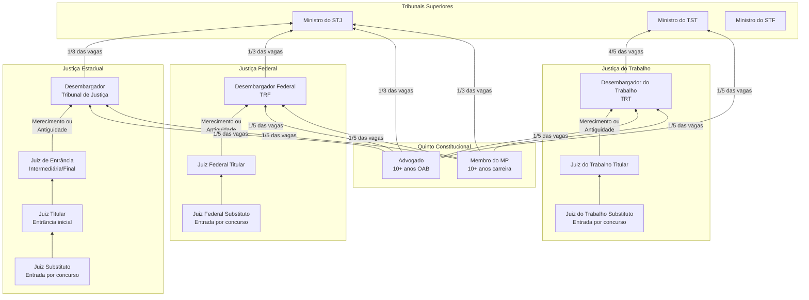

# Grafo da Carreira da Magistratura no Brasil

## Progressão na Carreira

## Requisitos para Ingresso

### Juiz Substituto (1ª instância)
- Bacharelado em Direito
- 3 anos de atividade jurídica (mínimo)
- Aprovação em concurso público de provas e títulos
- Etapas: prova objetiva, prova discursiva, prova oral, títulos, investigação social

### Desembargador (2ª instância)
- **Por antiguidade**: critério objetivo, o juiz mais antigo na lista
- **Por merecimento**: avaliação de produtividade, presteza, qualidade das decisões
- **Quinto constitucional**: 1/5 das vagas reservadas a advogados e membros do MP

### Ministro (Tribunais Superiores)
- Indicação do Presidente da República
- Aprovação pelo Senado Federal (maioria absoluta para STF)
- Requisitos variam conforme o tribunal

## Garantias Constitucionais

| Garantia | Descrição |
|----------|-----------|
| Vitaliciedade | Após 2 anos, só perde cargo por sentença judicial transitada em julgado |
| Inamovibilidade | Não pode ser removido contra a vontade (salvo interesse público) |
| Irredutibilidade de subsídios | Remuneração não pode ser reduzida |

## Vedações Constitucionais

- Exercer outro cargo (exceto magistério)
- Receber custas ou participação em processos
- Dedicar-se a atividade político-partidária
- Exercer advocacia no juízo de origem (quarentena de 3 anos)

## Aposentadoria

| Modalidade | Requisito |
|------------|-----------|
| Compulsória | 75 anos de idade |
| Voluntária | 62 anos (mulher) / 65 anos (homem) + 25 anos de serviço público |

## Nós Relacionados
- [Hierarquia do Judiciário](./hierarquia_judiciario.md)
- [Estatísticas](./estatisticas_judiciario.md)
- [Indicações Presidenciais](./indicacoes_presidenciais.md)
