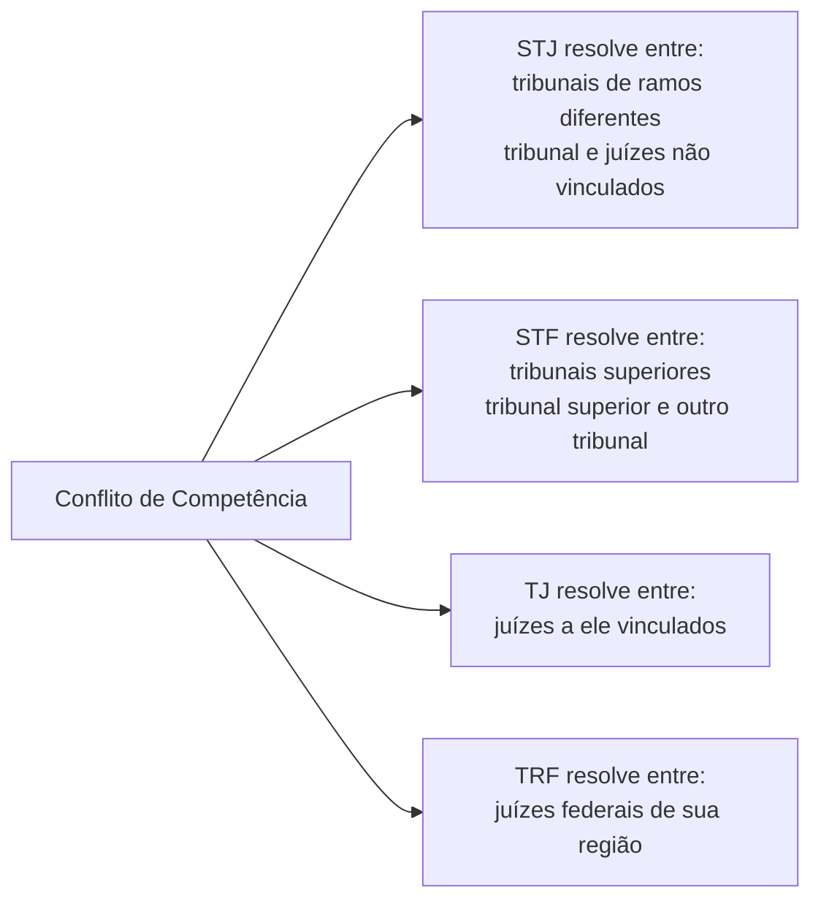

# Grafo de Competências Materiais do Judiciário

## Distribuição de Competência por Matéria

```mermaid
graph TD
    subgraph Materias[Matérias Jurídicas]
        Const[Constitucional]
        Civ[Civil]
        Pen[Penal]
        Trab[Trabalhista]
        Trib[Tributário]
        Adm[Administrativo]
        Amb[Ambiental]
        Eleit[Eleitoral]
        Mil[Militar]
        Prev[Previdenciário]
        Emp[Empresarial]
        Cons[Consumidor]
        Fam[Família e Sucessões]
        Inf[Infância e Juventude]
        Exec[Execução Fiscal]
    end

    subgraph Tribunais[Competência Principal]
        STF_t[STF]
        STJ_t[STJ]
        TST_t[TST/TRTs]
        TSE_t[TSE/TREs]
        STM_t[STM]
        TRF_t[TRFs]
        TJ_t[TJs]
    end

    Const --> STF_t
    Civ --> TJ_t
    Civ --> STJ_t
    Pen --> TJ_t
    Pen --> STJ_t
    Trab --> TST_t
    Trib --> TRF_t
    Trib --> TJ_t
    Adm --> TRF_t
    Adm --> TJ_t
    Amb --> TRF_t
    Amb --> TJ_t
    Eleit --> TSE_t
    Mil --> STM_t
    Prev --> TRF_t
    Emp --> TJ_t
    Cons --> TJ_t
    Fam --> TJ_t
    Inf --> TJ_t
    Exec --> TRF_t
    Exec --> TJ_t
```

## Competência da Justiça Federal (art. 109 CF)

| Matéria | Exemplos |
|---------|----------|
| Causas da União, autarquias, empresas públicas federais | INSS, CEF, IBAMA |
| Crimes federais | Tráfico internacional, contrabando, moeda falsa |
| Crimes políticos e infrações penais contra a União | |
| Habeas corpus em matéria criminal federal | |
| Mandado de segurança contra ato federal | |
| Crimes a bordo de aeronaves/embarcações | |
| Disputa sobre direitos indígenas | |
| Crimes previstos em tratados internacionais | |
| Execução fiscal federal | |

## Competência da Justiça Estadual (residual)

Tudo que não for de competência da Justiça Federal, do Trabalho, Eleitoral ou Militar.

| Matéria | Volume Aproximado |
|---------|-------------------|
| Direito de Família | ~15% dos processos |
| Direito do Consumidor | ~12% |
| Direito Civil (obrigações) | ~10% |
| Execução Fiscal (estadual/municipal) | ~35% |
| Criminal (crimes comuns) | ~15% |
| Outros | ~13% |

## Competência da Justiça do Trabalho (art. 114 CF)

| Matéria | Descrição |
|---------|-----------|
| Relação de emprego | CLT, empregado x empregador |
| Relação de trabalho | Autônomos, eventuais, avulsos |
| Greve | Dissídios coletivos |
| Representação sindical | |
| Dano moral trabalhista | |
| Penalidades administrativas | Multas do MTE |
| Execução de ofício das contribuições previdenciárias | |

## Conflitos de Competência

## Nós Relacionados
- [Hierarquia do Judiciário](./hierarquia_judiciario.md)
- [Especialidades Jurídicas](./especialidades_juridicas.md)
- [Estatísticas](./estatisticas_judiciario.md)
