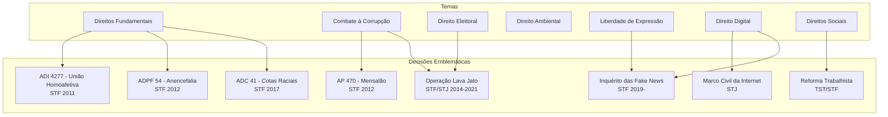

# Grafo de Decisões Emblemáticas do Judiciário Brasileiro

## Decisões por Tema e Tribunal

## Linha do Tempo — Marcos Jurisprudenciais

### 2010-2015
| Ano | Decisão | Tribunal | Relator | Impacto |
|-----|---------|----------|---------|---------|
| 2011 | ADI 4277 - União homoafetiva | STF | Ayres Britto | Reconhecimento da união estável entre pessoas do mesmo sexo |
| 2012 | AP 470 - Mensalão | STF | Joaquim Barbosa | Condenação de políticos por corrupção |
| 2012 | ADPF 54 - Anencefalia | STF | Marco Aurélio | Descriminalização da interrupção de gravidez de feto anencéfalo |
| 2014 | Início da Lava Jato | STF/STJ | Diversos | Maior operação anticorrupção da história do Brasil |

### 2015-2020
| Ano | Decisão | Tribunal | Relator | Impacto |
|-----|---------|----------|---------|---------|
| 2016 | Impeachment Dilma | STF | — | Afastamento da presidente |
| 2017 | ADC 41 - Cotas raciais | STF | Barroso | Constitucionalidade das cotas em concursos |
| 2019 | Criminalização da homofobia | STF | Celso de Mello | Equiparação ao crime de racismo |
| 2019 | Inquérito das Fake News | STF | Moraes | Investigação de ameaças ao STF |
| 2020 | Prisão após 2ª instância | STF | Marco Aurélio | Vedação de prisão antes do trânsito em julgado |

### 2020-2026
| Ano | Decisão | Tribunal | Relator | Impacto |
|-----|---------|----------|---------|---------|
| 2022 | Marco temporal terras indígenas | STF | Fachin/Barroso | Tese do marco temporal |
| 2023 | Descriminalização porte maconha | STF | Barroso | Uso pessoal x tráfico |
| 2023 | Reforma tributária | STF | — | Validação da EC 132/2023 |
| 2024 | Regulação plataformas digitais | STF/STJ | Diversos | Marco regulatório digital |
| 2025 | Suspensão X/Twitter | STF | Moraes | Bloqueio de plataforma digital |

## Relação Decisão → Ministro Relator

(A ser preenchido com dados detalhados de cada tribunal)

## Nós Relacionados
- [Hierarquia do Judiciário](./hierarquia_judiciario.md)
- [Especialidades Jurídicas](./especialidades_juridicas.md)
- [Indicações Presidenciais](./indicacoes_presidenciais.md)
