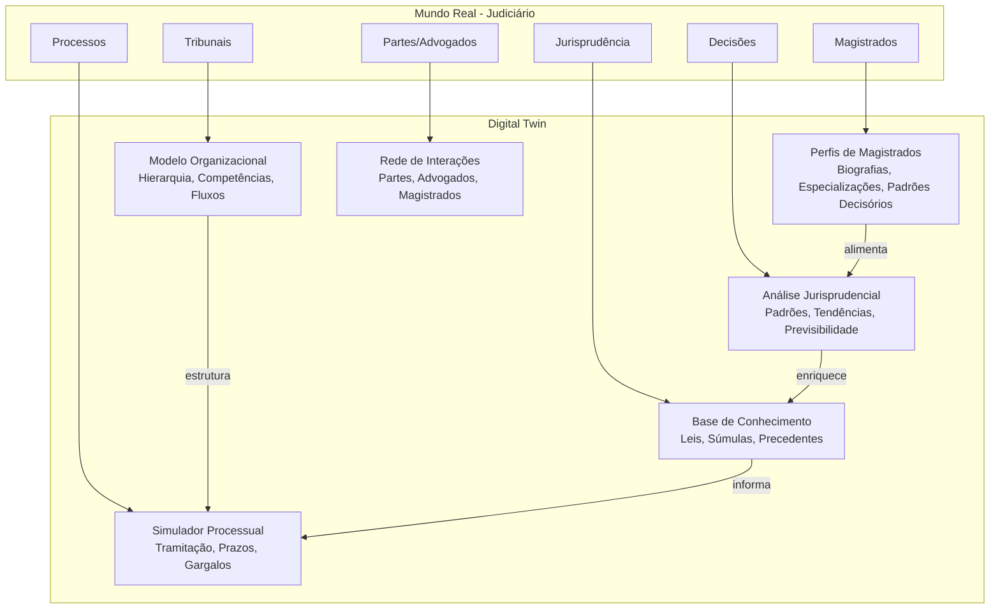
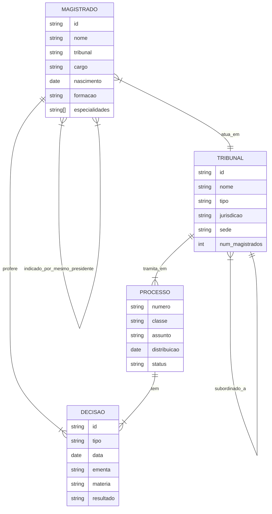

# Digital Twins do Poder Judiciário — Framework Conceitual

## Conceito

Digital Twin (Gêmeo Digital) aplicado ao Judiciário: representação virtual dinâmica que espelha a estrutura, os agentes, os processos e as decisões do Poder Judiciário brasileiro, permitindo simulação, análise preditiva e otimização.

## Camadas do Digital Twin

### 1. Camada de Dados (Data Layer)
- **Fontes**: CNJ, portais dos tribunais, DJe, Jurisprudência unificada
- **Formato**: JSONL estruturado (este dossiê)
- **Atualização**: Periódica via scraping ou APIs

### 2. Camada de Modelagem (Model Layer)
- **Ontologia**: Relações entre entidades (magistrado, tribunal, processo, decisão)
- **Grafos de Conhecimento**: Representação em nós e arestas
- **Taxonomia**: Classificação hierárquica (matéria, competência, instância)

### 3. Camada de Simulação (Simulation Layer)
- **Predição de decisões**: Baseada em perfil do magistrado + jurisprudência
- **Análise de tempo**: Estimativa de duração processual
- **Cenários**: What-if para mudanças legislativas

### 4. Camada de Visualização (Visualization Layer)
- **Dashboards**: Métricas de produtividade judicial
- **Mapas**: Distribuição geográfica de magistrados e processos
- **Redes**: Grafos interativos de relações

## Entidades do Modelo

## Aplicações Acadêmicas

1. **Análise de Padrões Decisórios**: Identificar tendências de voto por magistrado/tribunal
2. **Predição Jurisprudencial**: Modelos de ML para prever resultado de julgamentos
3. **Análise de Redes**: Mapeamento de relações e influências entre magistrados
4. **Eficiência Judicial**: Simulação de reformas para redução de acervo
5. **Transparência**: Acesso público a dados estruturados do judiciário

## Dados deste Dossiê como Insumo

Os arquivos JSONL deste dossiê servem como a **Camada de Dados** inicial para construção do Digital Twin:
- `ministros.jsonl` / `desembargadores.jsonl` → Entidade MAGISTRADO
- `README.md` de cada tribunal → Entidade TRIBUNAL
- Decisões documentadas → Entidade DECISAO
- Grafos em markdown → Relações entre entidades

## Nós Relacionados
- [Hierarquia do Judiciário](./hierarquia_judiciario.md)
- [Especialidades Jurídicas](./especialidades_juridicas.md)
- [Decisões Emblemáticas](./decisoes_emblematicas.md)
