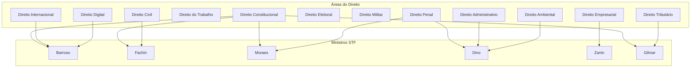

# Grafo de Especialidades Jurídicas dos Magistrados

## Áreas do Direito e Magistrados Associados

## Classificação por Área de Atuação

### Direito Constitucional
- Ministros com forte atuação: Barroso, Fachin, Moraes, Gilmar Mendes
- Tribunais: STF (competência principal)

### Direito Penal
- Ministros com forte atuação: Moraes, Dino, Zanin
- Tribunais: STF (foro privilegiado), STJ (6ª Turma, 5ª Turma)

### Direito Civil
- Ministros com forte atuação: Fachin
- Tribunais: STJ (3ª Turma, 4ª Turma), TJs estaduais

### Direito Tributário
- Ministros com forte atuação: Gilmar Mendes
- Tribunais: STF, STJ (1ª Seção)

### Direito do Trabalho
- Tribunal: TST, TRTs
- Área exclusiva da Justiça do Trabalho

### Direito Eleitoral
- Tribunal: TSE, TREs
- Ministros rotativos do STF e STJ

### Direito Militar
- Tribunal: STM, Auditorias Militares
- Área exclusiva da Justiça Militar

## Nós Relacionados
- [Hierarquia do Judiciário](./hierarquia_judiciario.md)
- [Indicações Presidenciais](./indicacoes_presidenciais.md)
- [Grafo de Decisões Emblemáticas](./decisoes_emblematicas.md)
