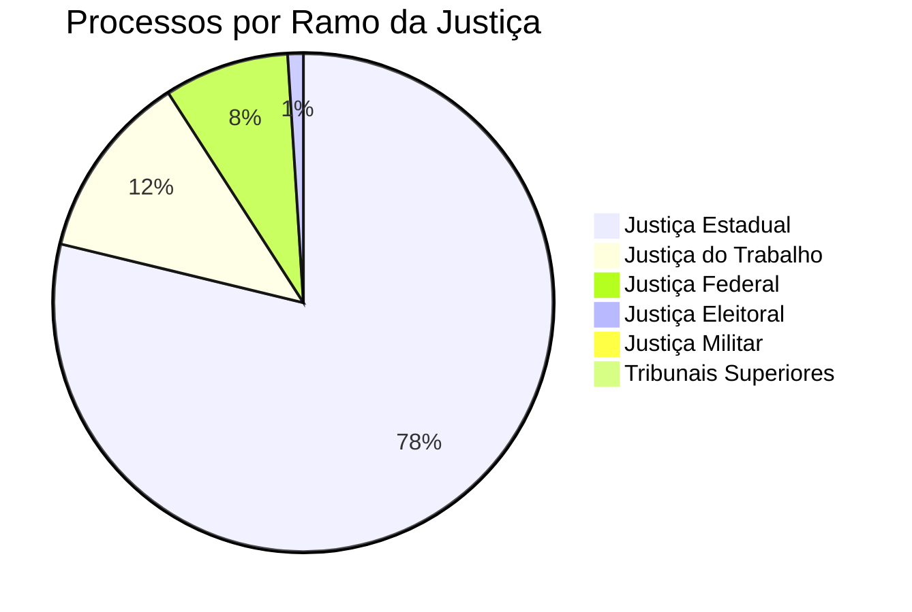

# Estatísticas do Poder Judiciário Brasileiro

Fonte principal: Relatório Justiça em Números (CNJ)

## Panorama Geral (dados aproximados 2024-2025)

### Dimensões do Judiciário
| Indicador | Valor |
|-----------|-------|
| Total de magistrados | ~18.000 |
| Total de servidores | ~270.000 |
| Total de processos em tramitação | ~80 milhões |
| Processos novos por ano | ~30 milhões |
| Processos julgados por ano | ~32 milhões |
| Despesa total | ~R$ 110 bilhões/ano |
| Custo por habitante | ~R$ 540/ano |

### Distribuição por Ramo

### Magistrados por Ramo

| Ramo | Magistrados | % |
|------|------------|---|
| Justiça Estadual | ~12.000 | 66% |
| Justiça do Trabalho | ~3.500 | 19% |
| Justiça Federal | ~1.800 | 10% |
| Justiça Eleitoral | ~300 (fixos) | 2% |
| Justiça Militar | ~40 | 0.2% |
| Tribunais Superiores | ~93 | 0.5% |

### Maiores Tribunais (por desembargadores)

| Tribunal | Desembargadores | Processos em tramitação |
|----------|----------------|------------------------|
| TJSP | ~360 | ~25 milhões |
| TJRJ | ~180 | ~12 milhões |
| TJMG | ~140 | ~8 milhões |
| TJRS | ~140 | ~5 milhões |
| TJPR | ~120 | ~4 milhões |
| TRT2 (SP) | ~90 | ~2 milhões |
| TRT15 (Campinas) | ~70 | ~1,5 milhão |

## Taxa de Congestionamento

## Perfil dos Magistrados

| Indicador | Valor |
|-----------|-------|
| Idade média | ~48 anos |
| % Mulheres | ~38% |
| % com pós-graduação | ~70% |
| % com doutorado | ~15% |
| Tempo médio de carreira | ~20 anos |

## Produtividade Média

| Instância | Processos/magistrado/ano |
|-----------|--------------------------|
| 1º grau | ~1.800 |
| 2º grau | ~800 |
| Tribunais Superiores | ~3.500 (STJ) |

## Nós Relacionados
- [Hierarquia do Judiciário](./hierarquia_judiciario.md)
- [CNJ](./estrutura_cnj.md)
- [Digital Twins](./digital_twins_judiciario.md)
