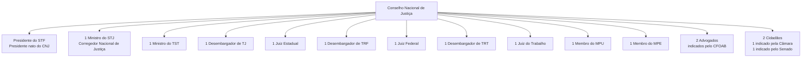

# Grafo do Conselho Nacional de Justiça (CNJ)

## Função
O CNJ é o órgão de controle administrativo e financeiro do Poder Judiciário, criado pela EC 45/2004 (Reforma do Judiciário).

## Composição (15 membros)

## Competências Principais

1. **Controle Administrativo**: Fiscalização administrativa e financeira dos tribunais
2. **Controle Disciplinar**: Processos disciplinares contra magistrados
3. **Políticas Judiciárias**: Definição de metas e programas nacionais
4. **Transparência**: Relatório Justiça em Números, portais de transparência
5. **Tecnologia**: Padronização de sistemas (PJe, BNMP, DataJud)

## Sistemas e Bases de Dados do CNJ

| Sistema | Descrição | Relevância para Digital Twin |
|---------|-----------|------------------------------|
| DataJud | Base nacional de dados processuais | Fonte primária de dados processuais |
| PJe | Processo Judicial eletrônico | Sistema de tramitação |
| BNMP | Banco Nacional de Mandados de Prisão | Dados penais |
| Justiça em Números | Relatório anual estatístico | Métricas de produtividade |
| SREI | Sistema de Registro Eletrônico de Imóveis | Dados registrais |
| e-Gestão | Sistema de gestão estratégica | Indicadores de desempenho |
| SISBAJUD | Sistema de busca de ativos | Dados financeiros judiciais |

## Metas Nacionais do Judiciário

O CNJ define anualmente metas para todos os tribunais:
- Meta 1: Julgar mais processos que os distribuídos
- Meta 2: Julgar processos mais antigos
- Meta 4: Priorizar processos de crimes contra a administração pública
- Meta 6: Priorizar processos coletivos
- Meta 7: Impulsionar processos de execução fiscal

## Nós Relacionados
- [Hierarquia do Judiciário](./hierarquia_judiciario.md)
- [Digital Twins](./digital_twins_judiciario.md)
- [Dados Estatísticos](./estatisticas_judiciario.md)
