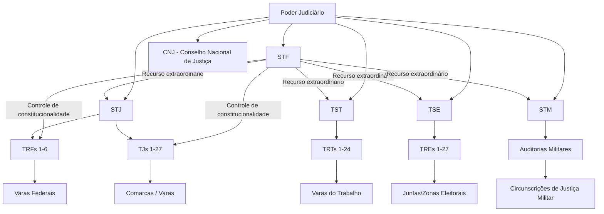

# Grafo Hierárquico do Poder Judiciário Brasileiro

## Nó Raiz: Poder Judiciário

## Relações de Competência Recursal

| Tribunal Superior | Recebe recursos de | Matéria |
|---|---|---|
| STF | Todos os tribunais | Constitucional |
| STJ | TRFs, TJs | Infraconstitucional federal |
| TST | TRTs | Trabalhista |
| TSE | TREs | Eleitoral |
| STM | Auditorias Militares | Militar |

## Composição por Origem

### STF (11 ministros)
- Indicação: Presidente da República
- Aprovação: Senado Federal (maioria absoluta)
- Requisitos: notável saber jurídico, reputação ilibada, 35-70 anos

### STJ (33 ministros)
- 1/3 dentre desembargadores dos TRFs
- 1/3 dentre desembargadores dos TJs
- 1/3 dentre advogados e membros do MP (alternadamente)

### TST (27 ministros)
- 1/5 dentre advogados e membros do MPT
- 4/5 dentre juízes dos TRTs

### TSE (7 ministros)
- 3 dentre ministros do STF (eleição)
- 2 dentre ministros do STJ (eleição)
- 2 advogados indicados pelo STF e nomeados pelo Presidente

### STM (15 ministros)
- 10 militares (3 Marinha, 3 Exército, 3 Aeronáutica + 1 oficial-general)
- 5 civis (3 advogados, 1 juiz auditor, 1 membro do MPM)

## Nós Relacionados
- [Tribunais Superiores](../tribunais_superiores/)
- [Justiça Federal](../justica_federal/)
- [Justiça Estadual](../justica_estadual/)
- [Justiça do Trabalho](../justica_trabalho/)
- [Justiça Eleitoral](../justica_eleitoral/)
- [Justiça Militar](../justica_militar/)
- [Grafo de Indicações](./indicacoes_presidenciais.md)
- [Grafo de Especialidades](./especialidades_juridicas.md)
