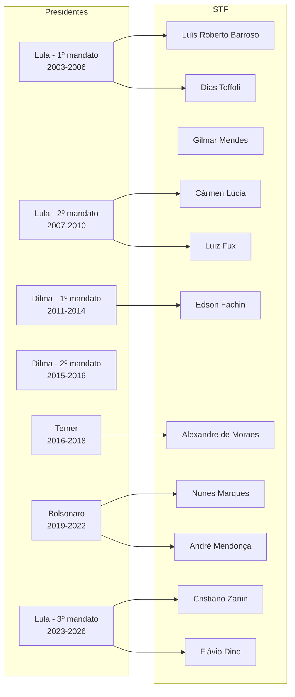

# Grafo de Indicações Presidenciais — Tribunais Superiores

## Relação Presidente → Ministro

## Tabela Detalhada — STF

| Ministro | Indicado por | Ano de Posse | Vaga de |
|---|---|---|---|
| Gilmar Mendes | FHC | 2002 | Néri da Silveira |
| Cármen Lúcia | Lula | 2006 | Nelson Jobim |
| Dias Toffoli | Lula | 2009 | Carlos Alberto Menezes Direito |
| Luiz Fux | Dilma | 2011 | Eros Grau |
| Luís Roberto Barroso | Dilma | 2013 | Ayres Britto |
| Edson Fachin | Dilma | 2015 | Joaquim Barbosa |
| Alexandre de Moraes | Temer | 2017 | Teori Zavascki |
| Nunes Marques | Bolsonaro | 2020 | Celso de Mello |
| André Mendonça | Bolsonaro | 2021 | Marco Aurélio |
| Cristiano Zanin | Lula | 2023 | Ricardo Lewandowski |
| Flávio Dino | Lula | 2023 | Rosa Weber |

## Nós Relacionados
- [Hierarquia do Judiciário](./hierarquia_judiciario.md)
- [STF - Detalhes](../tribunais_superiores/stf/README.md)
- [Especialidades Jurídicas](./especialidades_juridicas.md)
