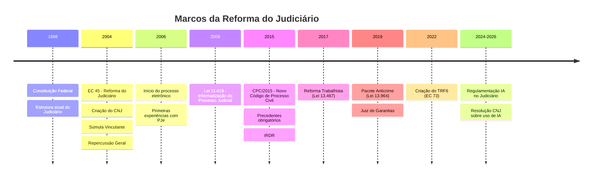
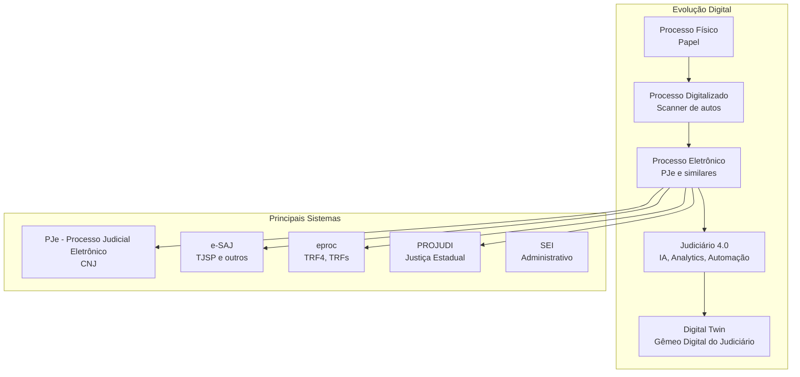

# Grafo das Reformas do Judiciário Brasileiro

## Linha do Tempo das Principais Reformas

## EC 45/2004 — A Grande Reforma

### Principais Inovações

| Inovação | Impacto |
|----------|---------|
| CNJ | Controle externo administrativo |
| Súmula Vinculante | Uniformização de jurisprudência |
| Repercussão Geral | Filtro de recursos no STF |
| Federalização de crimes contra DH | Incidente de deslocamento de competência |
| Quarentena | 3 anos para advogar após deixar cargo |
| Autonomia financeira | PJ com orçamento próprio |
| Justiça itinerante | Obrigatoriedade |
| Câmaras regionais | Descentralização dos TRFs |

## Digitalização do Judiciário

## IA no Judiciário

### Sistemas de IA em uso

| Sistema | Tribunal | Função |
|---------|----------|--------|
| VICTOR | STF | Análise de repercussão geral |
| SOCRATES | STJ | Agrupamento de processos repetitivos |
| ATHOS | STJ | Pesquisa jurisprudencial |
| RADAR | TRF3 | Identificação de demandas repetitivas |
| ELIS | TST | Análise de admissibilidade |
| LEIA | TJMG | Leitura de petições iniciais |
| POTI | TJRN | Automação de decisões |
| DRA. LUZIA | TJRO | Análise de processos |
| CLARA | TRF1 | Classificação de processos |

### Regulamentação

- **Resolução CNJ 332/2020**: Ética, transparência e governança na produção e uso de IA
- **Portaria CNJ 271/2020**: Modelo de governança de IA para o Judiciário
- **Resolução CNJ 385/2021**: Criação de núcleos de IA nos tribunais

## Desafios Atuais

1. **Acervo processual**: ~80 milhões de processos pendentes
2. **Morosidade**: Tempo médio até sentença ~2-4 anos (1ª instância)
3. **Acesso à justiça**: Desigualdade regional na distribuição de juízes
4. **Orçamento**: Judiciário consome ~1,3% do PIB
5. **Digitalização desigual**: Sistemas diferentes entre tribunais

## Nós Relacionados
- [CNJ](./estrutura_cnj.md)
- [Digital Twins](./digital_twins_judiciario.md)
- [Estatísticas](./estatisticas_judiciario.md)
- [Hierarquia](./hierarquia_judiciario.md)
