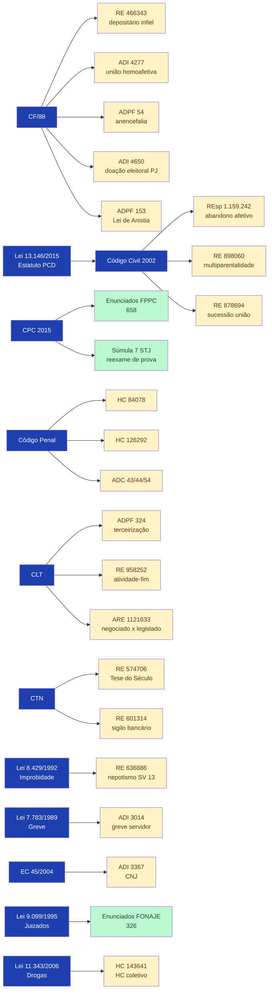
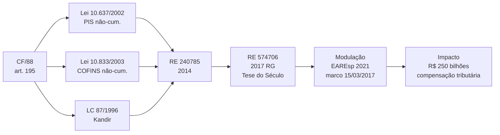
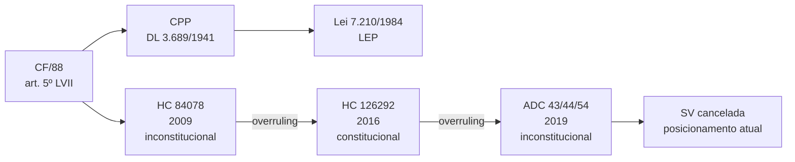
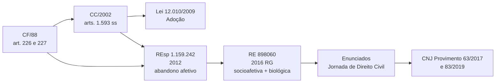
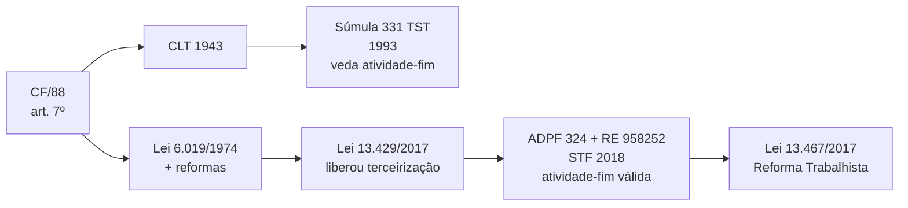
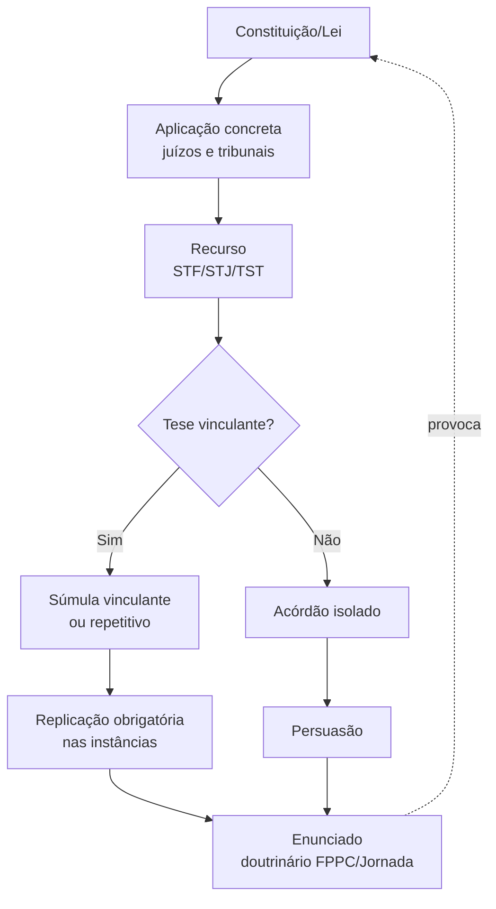

# Cruzamento Legislação ↔ Jurisprudência

> Grafos Mermaid relacionando os 167 registros de legislação (federal + local) com as 90 decisões emblemáticas.

## 1. Lei → Decisão Paradigmática

## 2. Trilhas tema → lei → jurisprudência → súmula

### Trilha 1 — Tributário (Tese do Século)

### Trilha 2 — Penal (Presunção de inocência)

### Trilha 3 — Família (Multiparentalidade)

### Trilha 4 — Trabalhista (Terceirização)

## 3. Mapa cruzado por área

```mermaid
graph TB
    subgraph Civil
        CIV_L[CC + LINDB + LGPD + EPCD]
        CIV_J[REsp 1.159.242 · RE 898060 · RE 878694]
        CIV_S[Súm. 7 STJ · 642 enunciados Jornadas]
        CIV_L --> CIV_J --> CIV_S
    end

    subgraph Penal
        PEN_L[CP + CPP + Hediondos + Drogas + LEP]
        PEN_J[HC 84078 → 126292 → ADC 43/44/54 · AP 470 · HC 143641]
        PEN_S[SV 11 + SV 26 · 326 enunciados FONAJE]
        PEN_L --> PEN_J --> PEN_S
    end

    subgraph Tributário
        TRI_L[CTN + LRF + Kandir + ISS + PIS/COFINS]
        TRI_J[RE 574706 · RE 601314 · RE 586482]
        TRI_S[SV 8 · SV 24 · SV 28 · SV 30]
        TRI_L --> TRI_J --> TRI_S
    end

    subgraph Trabalhista
        TRA_L[CLT + Reforma + FGTS + Previdência]
        TRA_J[ADPF 324 · RE 958252 · ARE 1121633 · ADI 5766]
        TRA_S[463 súmulas TST]
        TRA_L --> TRA_J --> TRA_S
    end

    subgraph Administrativo
        ADM_L[Lei 9.784 · LAI · 8.112 · 8.429 · 14.133]
        ADM_J[RE 589998 · RE 636886 · RE 855091]
        ADM_S[SV 13 · SV 21 · SV 33]
        ADM_L --> ADM_J --> ADM_S
    end

    subgraph Constitucional
        CONS_L[CF/88 + EC 45 + EC 95 + EC 103 + EC 132]
        CONS_J[ADI 4650 · ADPF 153 · ADI 3367]
        CONS_S[62 súmulas vinculantes STF]
        CONS_L --> CONS_J --> CONS_S
    end

    classDef l fill:#1e40af,color:#fff;
    classDef j fill:#fef3c7,color:#78350f;
    classDef s fill:#bbf7d0,color:#14532d;
    class CIV_L,PEN_L,TRI_L,TRA_L,ADM_L,CONS_L l;
    class CIV_J,PEN_J,TRI_J,TRA_J,ADM_J,CONS_J j;
    class CIV_S,PEN_S,TRI_S,TRA_S,ADM_S,CONS_S s;
```

## 4. Ciclo normativo-jurisprudencial (modelo simplificado)

---

## Fonte
Compilação cruzada de:
- `legislacao_federal/` (86) + `legislacao_local/` (81) = 167 normas
- `jurisprudencia/` (90 decisões)
- `sumulas/` (705 súmulas) — STF 62 · STJ 107 · TST 463 · TSE 73
- `enunciados/` (1.744) — Civil 642 · Comercial 118 · FONAJE 326 · FPPC 658

**Skills correspondentes:**
- `skills/dossie-jurisprudencia-br/SKILL.md`
- `skills/dossie-legislacao-br/SKILL.md`
- `skills/dossie-sumulas-enunciados-br/SKILL.md`
