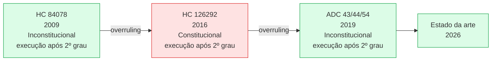
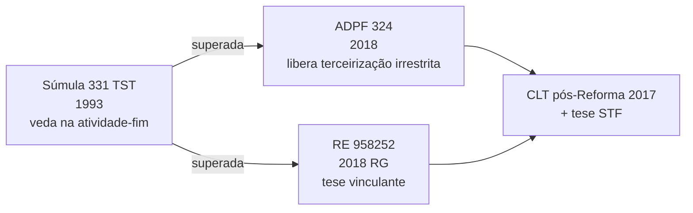
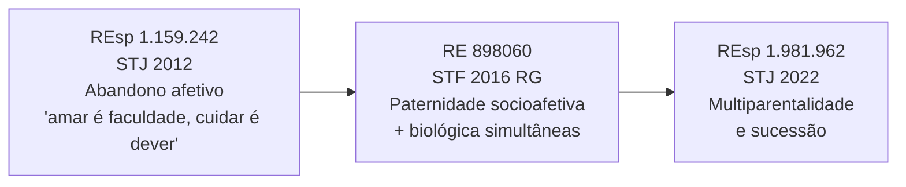
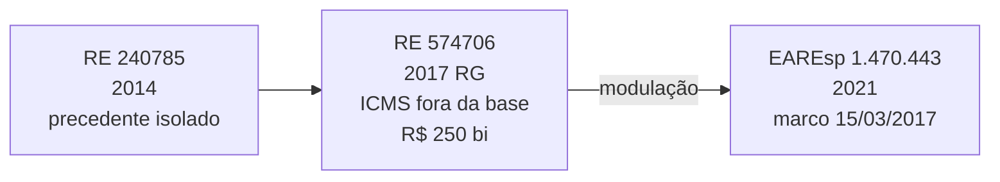
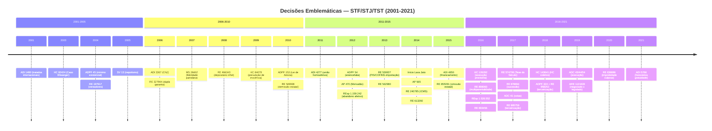
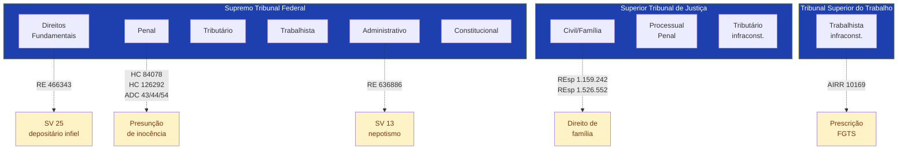
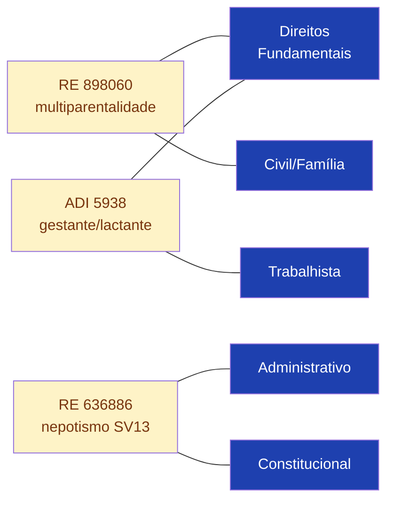
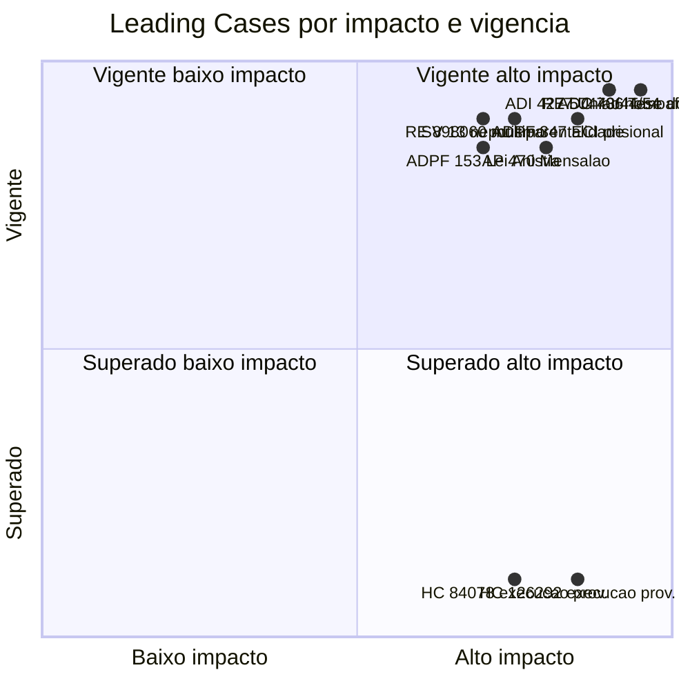

# Mapa da Jurisprudência Temática Brasileira

> Grafos Mermaid das 90 decisões emblemáticas do STF/STJ/TST catalogadas em `dossie_judiciario/jurisprudencia/`.

## 1. Árvore por Área (90 decisões)

```mermaid
graph TD
    J[Jurisprudência Temática<br/>90 decisões] --> DF[Direitos Fundamentais<br/>15]
    J --> PP[Penal e Processual Penal<br/>15]
    J --> CF[Civil e Família<br/>12]
    J --> TR[Tributário<br/>12]
    J --> TB[Trabalhista<br/>12]
    J --> AD[Administrativo e Público<br/>12]
    J --> CS[Constitucional STF<br/>12]

    DF --> DF1[RE 466343<br/>Depositário infiel]
    DF --> DF2[ADI 4277<br/>União homoafetiva]
    DF --> DF3[ADPF 54<br/>Anencefalia]
    DF --> DF4[ADPF 45<br/>Mínimo existencial]
    DF --> DF5[HC 82424<br/>Caso Ellwanger]

    PP --> PP1[HC 84078<br/>2009]
    PP --> PP2[HC 126292<br/>2016]
    PP --> PP3[ADC 43/44/54<br/>2019]
    PP --> PP4[AP 470<br/>Mensalão]
    PP --> PP5[HC 143641<br/>HC coletivo]

    CF --> CF1[REsp 1.159.242<br/>Abandono afetivo]
    CF --> CF2[RE 898060<br/>Multiparentalidade]
    CF --> CF3[RE 878694<br/>Sucessão união]

    TR --> TR1[RE 574706<br/>Tese do Século]
    TR --> TR2[RE 601314<br/>Sigilo bancário]
    TR --> TR3[RE 240785<br/>ICMS PIS/COFINS]

    TB --> TB1[ADPF 324<br/>Terceirização]
    TB --> TB2[RE 958252<br/>Atividade-fim]
    TB --> TB3[ARE 1121633<br/>Negociado x legislado]
    TB --> TB4[ADI 5766<br/>Honorários]

    AD --> AD1[RE 589998<br/>Demissão empresa pública]
    AD --> AD2[RE 636886<br/>Nepotismo SV 13]
    AD --> AD3[RE 855091<br/>Omissão estatal]
    AD --> AD4[RE 327904<br/>Dupla garantia]

    CS --> CS1[ADI 4650<br/>Doação eleitoral PJ]
    CS --> CS2[ADPF 153<br/>Lei de Anistia]
    CS --> CS3[ADI 3367<br/>CNJ]
    CS --> CS4[RE 197917<br/>Vereadores]

    classDef area fill:#1e40af,color:#fff,stroke:#1e3a8a;
    classDef caso fill:#fef3c7,color:#78350f,stroke:#d97706;
    class DF,PP,CF,TR,TB,AD,CS area;
```



## 2. Trilhas de Overruling (evolução jurisprudencial)

### Presunção de inocência — execução provisória da pena



### Terceirização



### Multiparentalidade e parentalidade socioafetiva



### Tese do Século (ICMS na base PIS/COFINS)



## 3. Linha do Tempo Cronológica



## 4. Cluster Tribunal × Área



## 5. Referências cruzadas entre áreas



## 6. Mapa de Relevância (leading_case × overruled)



---

## Fonte de dados

- `jurisprudencia/direitos_fundamentais/decisoes.jsonl` (15)
- `jurisprudencia/penal_processual_penal/decisoes.jsonl` (15)
- `jurisprudencia/civil_familia/decisoes.jsonl` (12)
- `jurisprudencia/tributario/decisoes.jsonl` (12)
- `jurisprudencia/trabalhista/decisoes.jsonl` (12)
- `jurisprudencia/administrativo_publico/decisoes.jsonl` (12)
- `jurisprudencia/constitucional_stf/decisoes.jsonl` (12)

Gerado a partir de `scripts/_agregado.json` consolidando os 7 JSONLs temáticos.

## Como usar
- **Renderização:** GitHub renderiza Mermaid nativamente; abra este arquivo no repo ou em qualquer leitor Markdown que suporte Mermaid (Obsidian, VSCode com extensão).
- **Edição:** editar diretamente os blocos ` ```mermaid ` neste arquivo.
- **Skill correspondente:** `skills/dossie-jurisprudencia-br/SKILL.md`.
