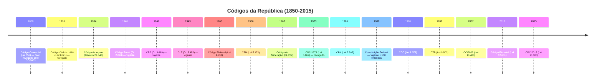
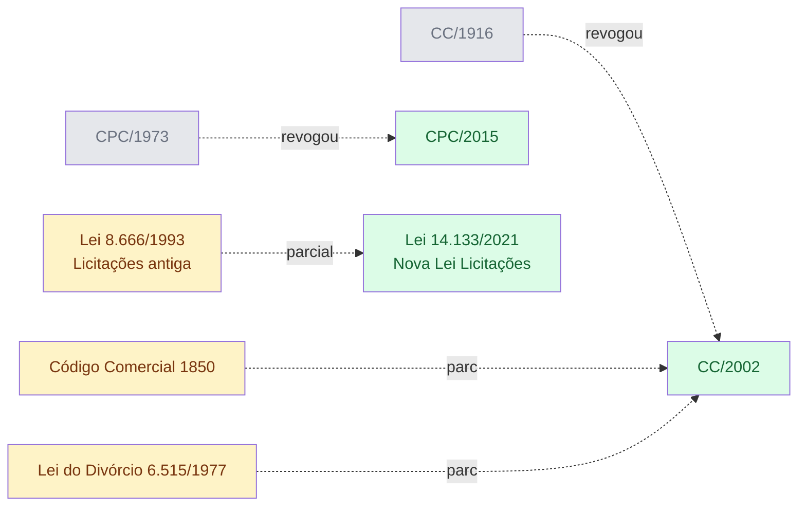
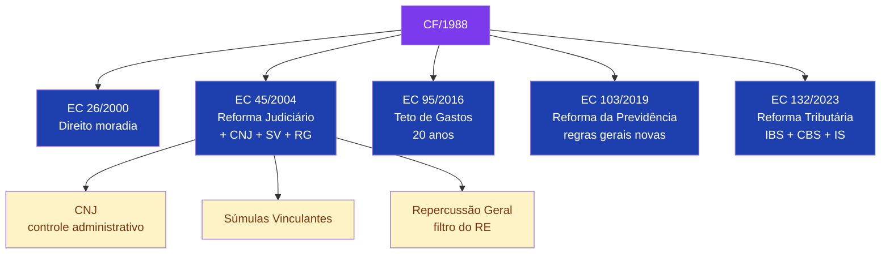
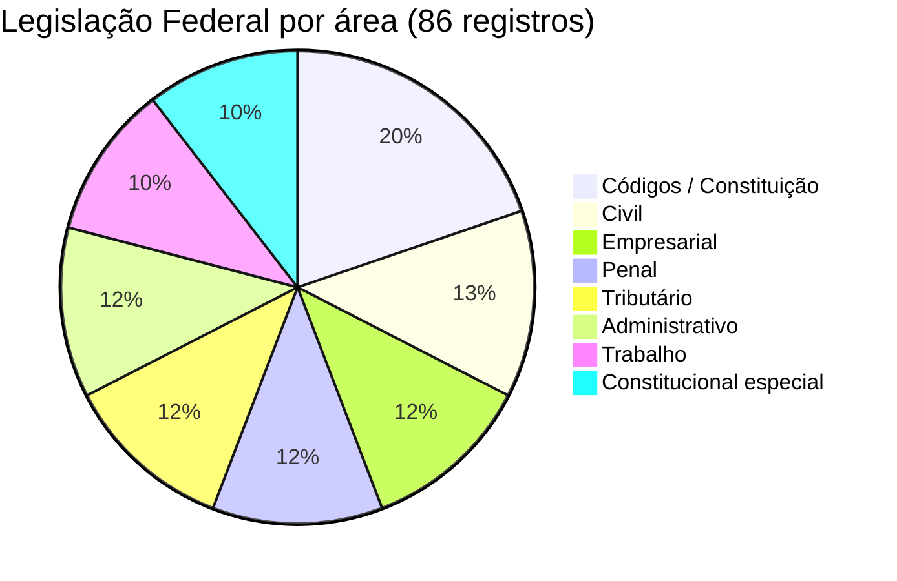

# Mapa da Legislação Federal Brasileira

> Grafos Mermaid dos 86 registros catalogados em `dossie_judiciario/legislacao_federal/`.

## 1. Árvore Constitucional → Códigos → Leis Especiais

```mermaid
graph TD
    CF[Constituição Federal<br/>CF/88]

    CF --> CIV[Civil]
    CF --> EMP[Empresarial]
    CF --> PEN[Penal]
    CF --> TRIB[Tributário]
    CF --> TRAB[Trabalho]
    CF --> ADM[Administrativo]
    CF --> CONS[Constitucional especial]

    CIV --> CC[Código Civil<br/>Lei 10.406/2002]
    CIV --> CPC[CPC<br/>Lei 13.105/2015]
    CIV --> CDC[CDC<br/>Lei 8.078/1990]

    CC --> LINDB[LINDB<br/>DL 4.657/1942]
    CC --> LMP[Lei Maria da Penha<br/>Lei 11.340/2006]
    CC --> LGPD[LGPD<br/>Lei 13.709/2018]
    CC --> LLOC[Lei de Locações<br/>Lei 8.245/1991]
    CC --> LRP[Registros Públicos<br/>Lei 6.015/1973]
    CC --> EPCD[Estatuto PCD<br/>Lei 13.146/2015]
    CC --> MCI[Marco Civil Internet<br/>Lei 12.965/2014]
    CC --> LPI[Propriedade Industrial<br/>Lei 9.279/1996]
    CC --> LDA[Direitos Autorais<br/>Lei 9.610/1998]

    EMP --> SA[Lei das S.A.<br/>Lei 6.404/1976]
    EMP --> FAL[Lei de Falências<br/>Lei 11.101/2005]
    EMP --> SN[Simples Nacional<br/>LC 123/2006]
    EMP --> ARB[Lei de Arbitragem<br/>Lei 9.307/1996]
    EMP --> ANTI[Lei Anticorrupção<br/>Lei 12.846/2013]
    EMP --> LIC[Nova Lei Licitações<br/>Lei 14.133/2021]

    PEN --> CP[Código Penal<br/>DL 2.848/1940]
    PEN --> CPP[CPP<br/>DL 3.689/1941]

    CP --> HED[Crimes Hediondos<br/>Lei 8.072/1990]
    CP --> DRO[Lei de Drogas<br/>Lei 11.343/2006]
    CP --> LEP[LEP<br/>Lei 7.210/1984]
    CP --> JESP[Juizados Especiais<br/>Lei 9.099/1995]
    CP --> LAV[Lavagem<br/>Lei 9.613/1998]
    CP --> ORG[Org. Criminosas<br/>Lei 12.850/2013]
    CP --> ABA[Abuso de Autoridade<br/>Lei 13.869/2019]
    CP --> AMB[Crimes Ambientais<br/>Lei 9.605/1998]
    CP --> IMP[Improbidade<br/>Lei 8.429/1992]

    TRIB --> CTN[CTN<br/>Lei 5.172/1966]
    CTN --> LRF[LRF<br/>LC 101/2000]
    CTN --> KAN[Lei Kandir<br/>LC 87/1996]
    CTN --> ISS[Lei do ISS<br/>LC 116/2003]
    CTN --> PIS[PIS não-cumulativo<br/>Lei 10.637/2002]
    CTN --> COF[COFINS<br/>Lei 10.833/2003]
    CTN --> IRPF[IRPF<br/>Lei 9.250/1995]
    CTN --> LEF[Execuções Fiscais<br/>Lei 6.830/1980]

    TRAB --> CLT[CLT<br/>DL 5.452/1943]
    CLT --> REF[Reforma Trabalhista<br/>Lei 13.467/2017]
    CLT --> FGTS[Lei do FGTS<br/>Lei 8.036/1990]
    CLT --> BEN[Previdência - Benefícios<br/>Lei 8.213/1991]
    CLT --> CUS[Previdência - Custeio<br/>Lei 8.212/1991]
    CLT --> GRE[Lei de Greve<br/>Lei 7.783/1989]
    CLT --> DOM[Doméstico<br/>LC 150/2015]

    ADM --> LPA[LPA<br/>Lei 9.784/1999]
    ADM --> LAI[LAI<br/>Lei 12.527/2011]
    ADM --> EST8112[Estatuto Servidor<br/>Lei 8.112/1990]
    ADM --> AGR[Agências Reguladoras<br/>Lei 13.848/2019]
    ADM --> PPP[Lei das PPPs<br/>Lei 11.079/2004]
    ADM --> CADE[Lei do CADE<br/>Lei 12.529/2011]

    CONS --> EC45[EC 45/2004<br/>Reforma Judiciário]
    CONS --> EC95[EC 95/2016<br/>Teto Gastos]
    CONS --> EC103[EC 103/2019<br/>Previdência]
    CONS --> EC132[EC 132/2023<br/>Tributária]
    CONS --> ADCT[ADCT]
    CONS --> ACP[ACP<br/>Lei 7.347/1985]
    CONS --> AP[Ação Popular<br/>Lei 4.717/1965]

    classDef root fill:#7c3aed,color:#fff,stroke:#5b21b6;
    classDef area fill:#1e40af,color:#fff,stroke:#1e3a8a;
    classDef cod fill:#dc2626,color:#fff,stroke:#991b1b;
    classDef esp fill:#fef3c7,color:#78350f,stroke:#d97706;
    class CF root;
    class CIV,EMP,PEN,TRIB,TRAB,ADM,CONS area;
    class CC,CPC,CDC,CP,CPP,CTN,CLT cod;
```

## 2. Códigos — Linha do Tempo

## 3. Status e revogações

## 4. Emendas Constitucionais estruturantes

## 5. Cobertura por área (86 normas)

---

## Fonte de dados
- `legislacao_federal/codigos/codigos.jsonl` (17)
- `legislacao_federal/civil/leis_civis.jsonl` (11)
- `legislacao_federal/empresarial/leis_empresariais.jsonl` (10)
- `legislacao_federal/penal/leis_penais.jsonl` (10)
- `legislacao_federal/tributario/leis_tributarias.jsonl` (10)
- `legislacao_federal/trabalho/leis_trabalhistas.jsonl` (9)
- `legislacao_federal/administrativo/leis_administrativas.jsonl` (10)
- `legislacao_federal/constitucional/leis_constitucionais.jsonl` (9)

**Skill correspondente:** `skills/dossie-legislacao-br/SKILL.md`.
