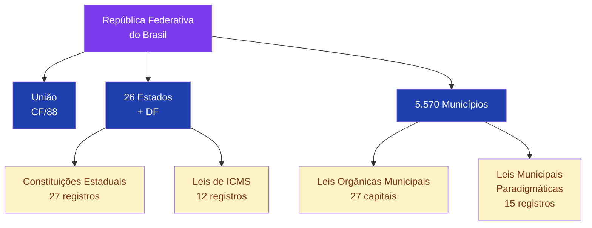
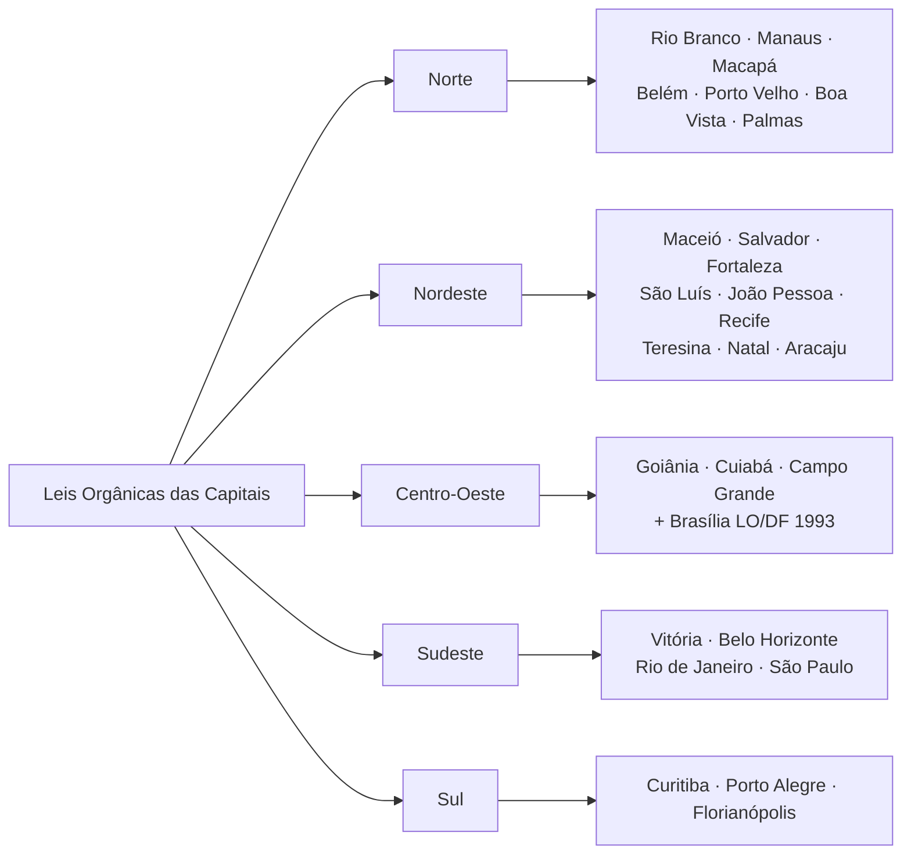
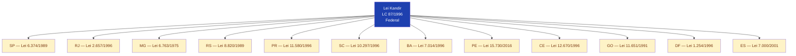
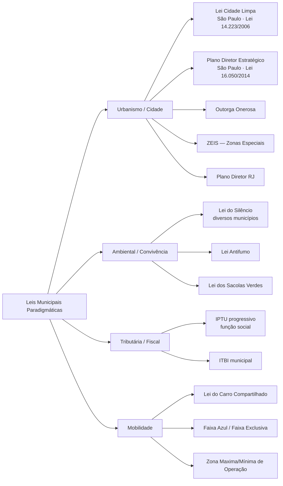
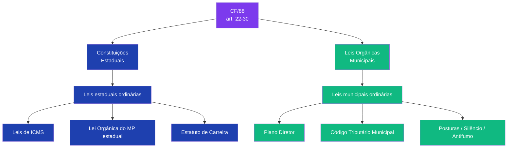
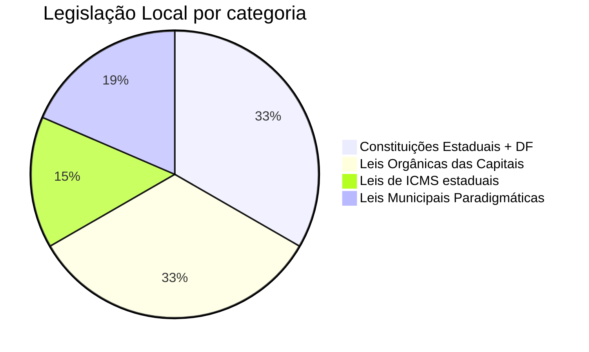

# Mapa da Legislação Local (Estadual + Municipal)

> Grafos Mermaid dos 81 registros catalogados em `dossie_judiciario/legislacao_local/`.

## 1. Estrutura Federativa

## 2. Distribuição geográfica — CEs por região

```mermaid
graph TB
    subgraph N[Norte 7]
        N1[AC] --- N2[AM] --- N3[AP] --- N4[PA] --- N5[RO] --- N6[RR] --- N7[TO]
    end
    subgraph NE[Nordeste 9]
        NE1[AL] --- NE2[BA] --- NE3[CE] --- NE4[MA] --- NE5[PB]
        NE6[PE] --- NE7[PI] --- NE8[RN] --- NE9[SE]
    end
    subgraph CO[Centro-Oeste 3 + DF]
        CO1[GO] --- CO2[MT] --- CO3[MS] --- CO4[DF<br/>LO 1993]
    end
    subgraph SE[Sudeste 4]
        SE1[ES] --- SE2[MG] --- SE3[RJ] --- SE4[SP]
    end
    subgraph SU[Sul 3]
        SU1[PR] --- SU2[RS] --- SU3[SC]
    end

    classDef ufN fill:#fde68a,color:#78350f;
    classDef ufNE fill:#fbcfe8,color:#831843;
    classDef ufCO fill:#bfdbfe,color:#1e3a8a;
    classDef ufSE fill:#bbf7d0,color:#14532d;
    classDef ufSU fill:#fecaca,color:#7f1d1d;
    class N1,N2,N3,N4,N5,N6,N7 ufN;
    class NE1,NE2,NE3,NE4,NE5,NE6,NE7,NE8,NE9 ufNE;
    class CO1,CO2,CO3,CO4 ufCO;
    class SE1,SE2,SE3,SE4 ufSE;
    class SU1,SU2,SU3 ufSU;
```

## 3. Capitais — Leis Orgânicas (27 registros)

## 4. ICMS estadual (12 leis catalogadas)

## 5. Leis municipais paradigmáticas (15 registros) — eixos temáticos

## 6. Federação normativa — fluxo hierárquico

## 7. Cobertura por categoria (81 normas)

---

## Fonte de dados
- `legislacao_local/constituicoes_estaduais/constituicoes.jsonl` (27)
- `legislacao_local/leis_organicas_municipais/principais_capitais.jsonl` (27)
- `legislacao_local/legislacao_tributaria_estadual/icms_estados.jsonl` (12)
- `legislacao_local/legislacao_municipal_referencia/leis_municipais_paradigmaticas.jsonl` (15)

**Skill correspondente:** `skills/dossie-legislacao-br/SKILL.md`.
