# Mapa de Súmulas e Enunciados

> Grafos Mermaid dos 705 súmulas (STF/STJ/TST/TSE) e 1.744 enunciados (Jornadas/FONAJE/FPPC) catalogados em `dossie_judiciario/sumulas/` e `dossie_judiciario/enunciados/`.

## 1. Visão geral por fonte

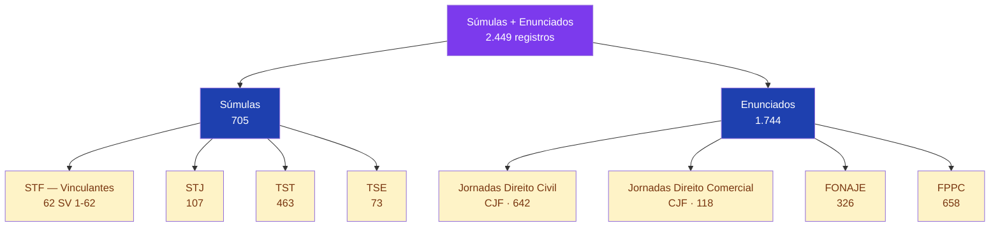

## 2. Súmulas Vinculantes STF — distribuição por área

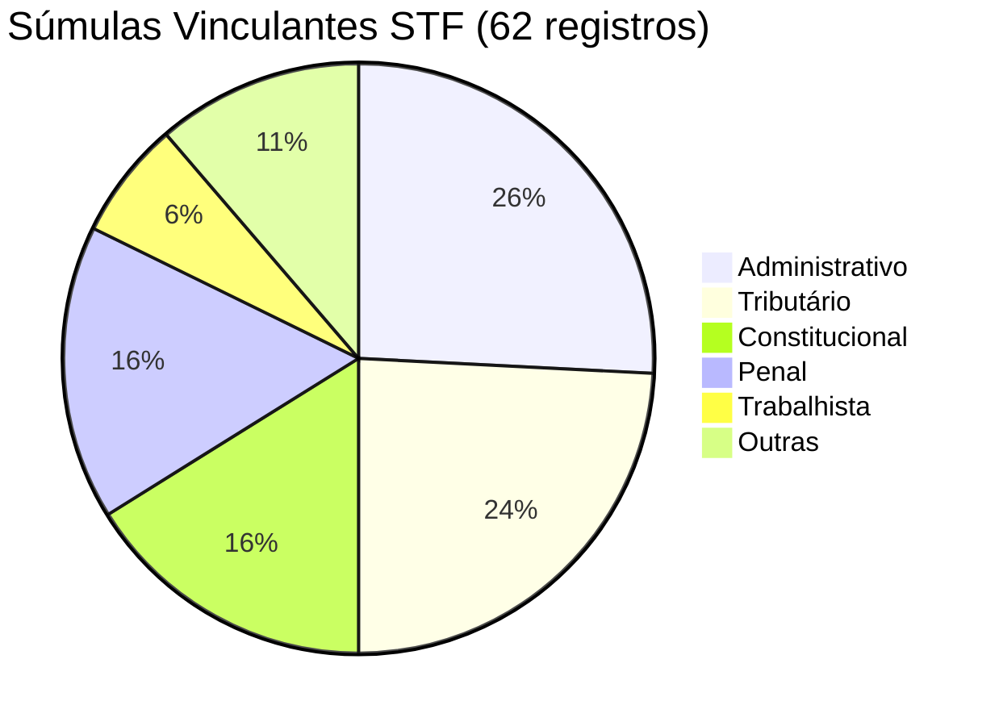

## 3. SV STF destacadas por área

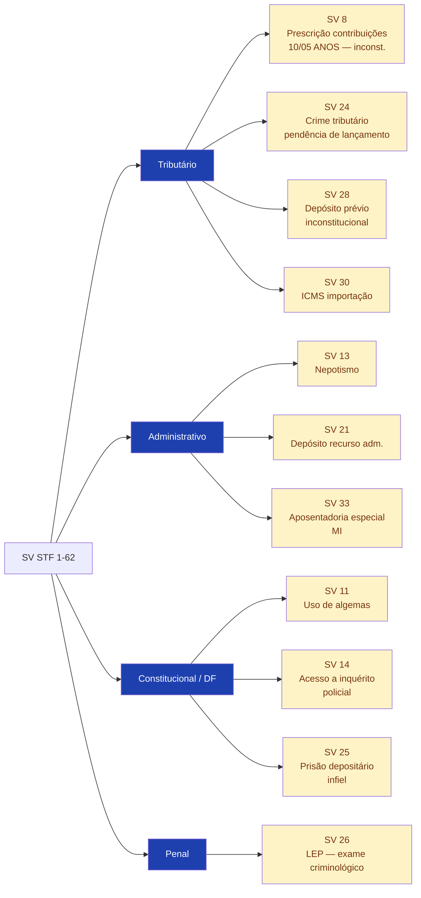

## 4. Súmulas TST — distribuição por subárea trabalhista

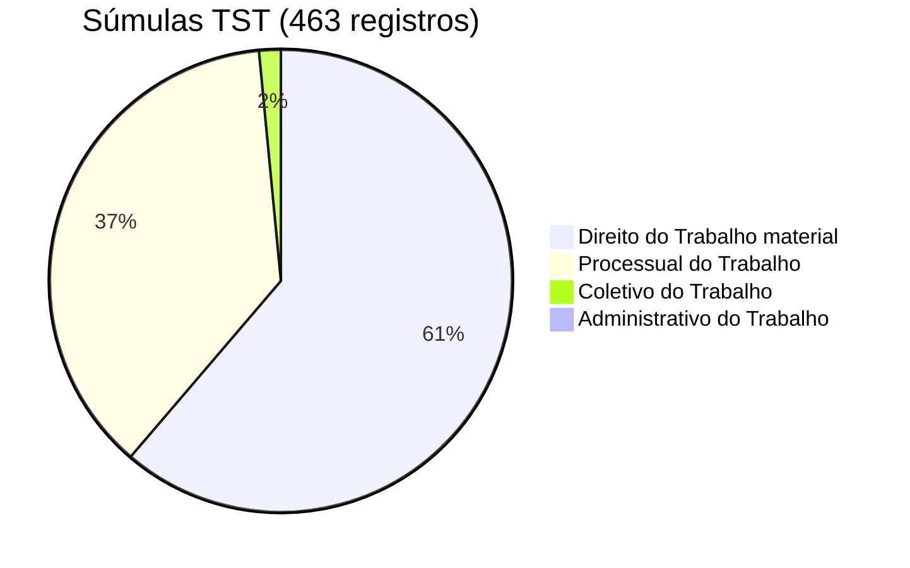

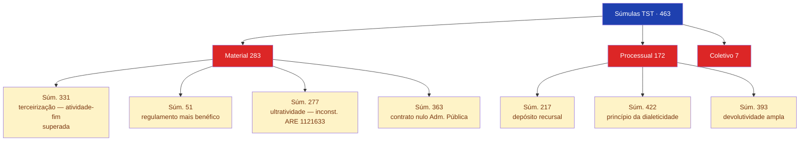

## 5. Súmulas STJ — destaques (107 catalogadas)

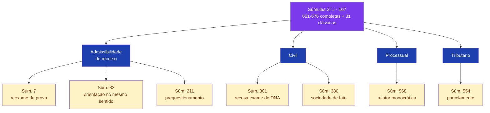

## 6. Súmulas TSE (73 registros)

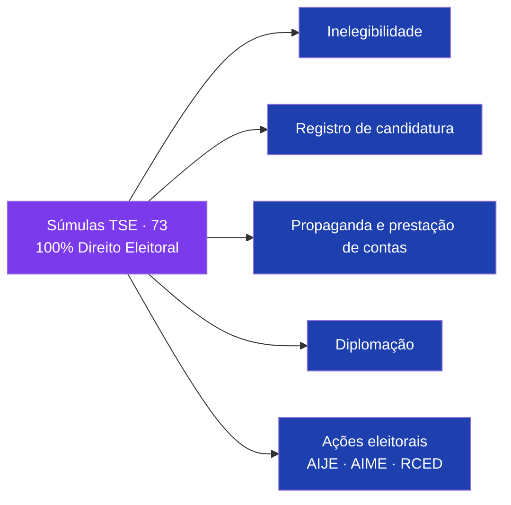

## 7. Enunciados das Jornadas de Direito Civil — por jornada

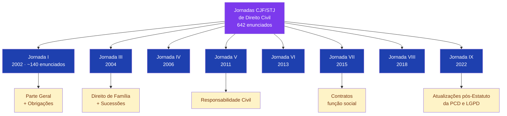

## 8. Enunciados FONAJE — por matéria

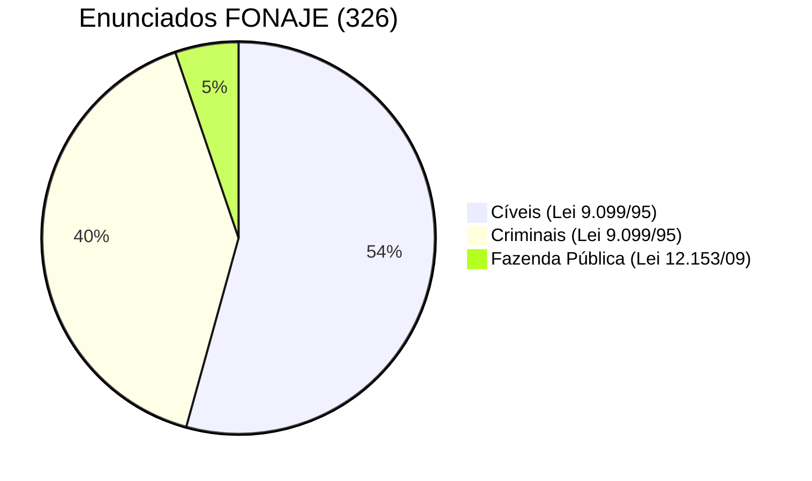

## 9. Enunciados FPPC — por bloco do CPC/2015

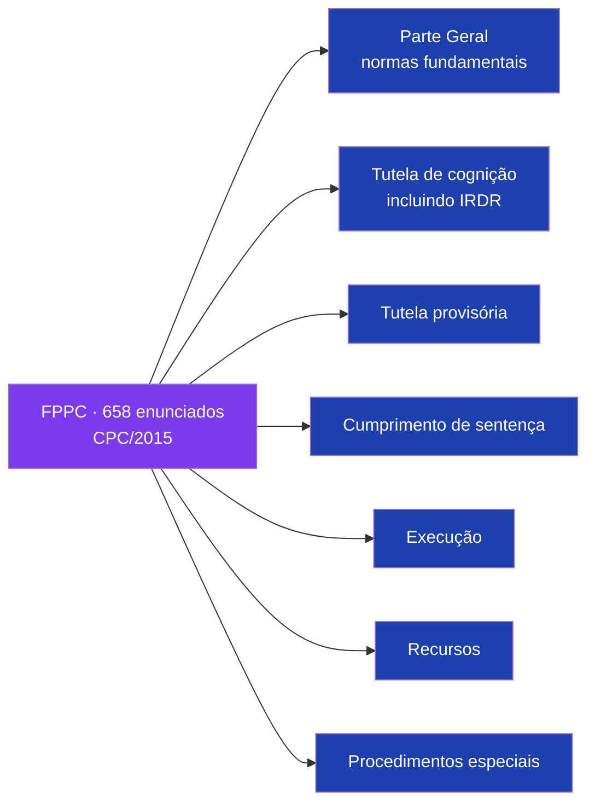

## 10. Visão integrada — pirâmide do precedente

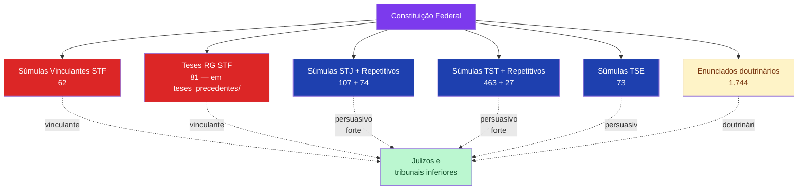

---

## Fonte de dados
- `sumulas/stf/sumulas_vinculantes.jsonl` (62)
- `sumulas/stj/*.jsonl` (107)
- `sumulas/tst/*.jsonl` (463)
- `sumulas/tse/*.jsonl` (73)
- `enunciados/jornadas_direito_civil/enunciados.jsonl` (642)
- `enunciados/jornadas_direito_comercial/enunciados.jsonl` (118)
- `enunciados/fonaje/enunciados.jsonl` (326)
- `enunciados/fppc/enunciados.jsonl` (658)

**Skill correspondente:** `skills/dossie-sumulas-enunciados-br/SKILL.md`.
